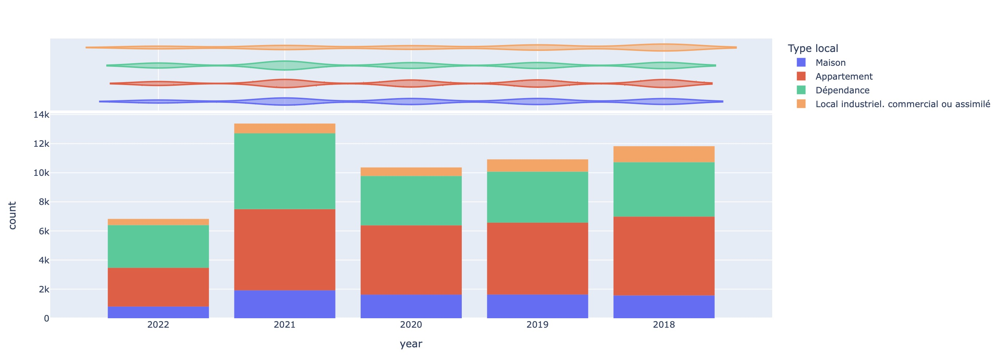
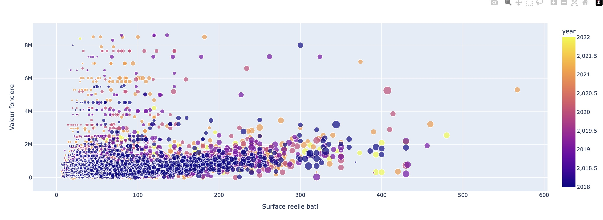
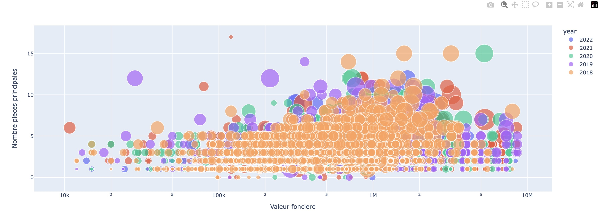
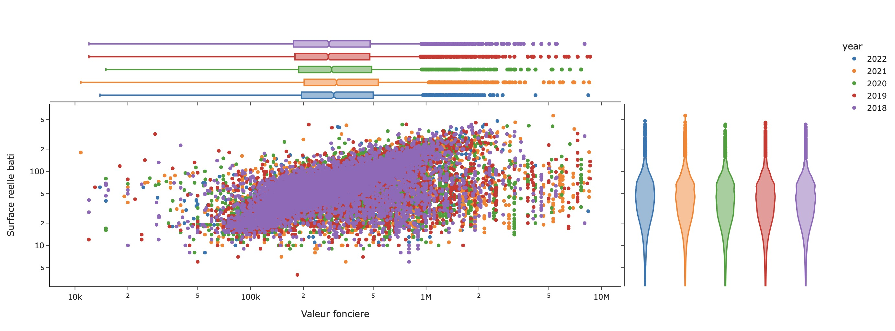
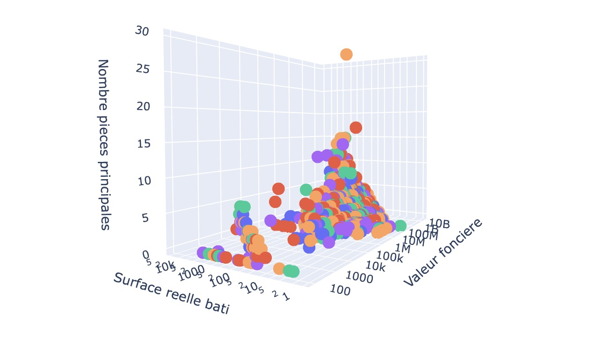

# 🏛️🏠 Analyse immobilier 

## 📖 Presentation

Analyse des biens immobiliers d'une ville. Mise en évidence des biens d'exception, calculs statistiques sur les ventes et prévision de l'evolution du marché. Utilisation de bibliothèques python data, seaborn et plotly pour la visualisation.

## 🚀 Road map

1. Récupération des données et préprocessing
2. Visualsation des données avec plotly
3. Affichage des données sur une carte interactive (In Progress)
4. Prédiction de l'évolution du marché sur les années à venir avec des algorithmes de ML simples (In Progress)

## 🏗️ Avancement du projet

Evolution des ventes par type selon l'année. Attention les données sont encore incomplètes pour 2022. On peut tout de même observer une nette chute en 2020 en raison de la crise du covid.

Comparaison du prix (valeur foncière) en fonction de la surface batie

Etude approfondie sur le nombre de pièces des biens vendus

Répartition statistique des biens selon leur prix et leur surface, en fonction de l'année. On note notamment que de nombreux biens d'exception ont été vendus en 2019 et 2021.

Visualisation 3D qui permet de visualiser la corrélation nombre de pièces, surface et prix.

## Créateur du projet

Alexandre Gravereaux

## Licence

Creative Commons CC-BY-NC-ND
